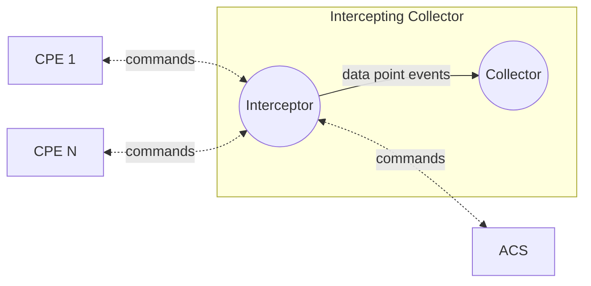
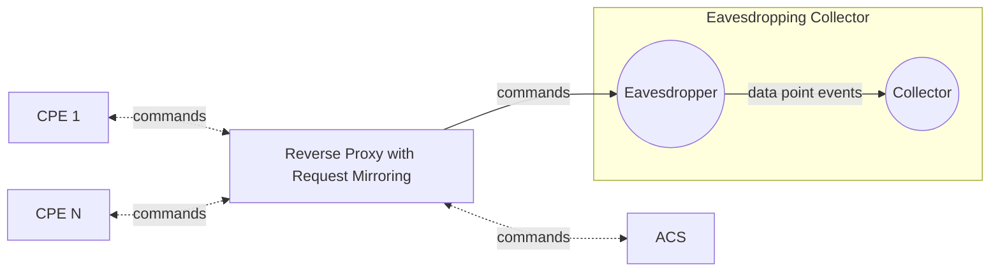

# CWMP interceptor

## Overview

Intercepts the communication between the CPEs and the ACS. Eavesdrop the CWMP protocol Inform messages.

## Context

CWMP Intercepting Collector

CWMP Eavesdropping Collector

