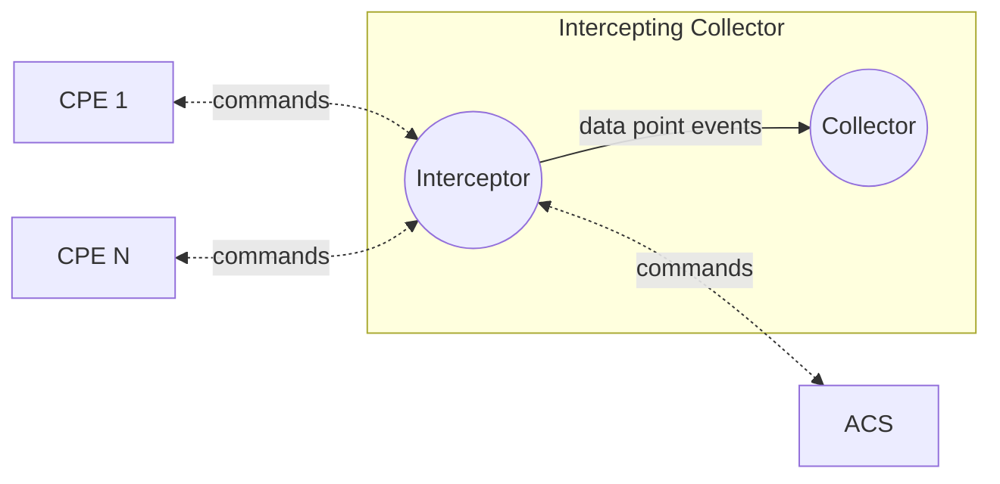
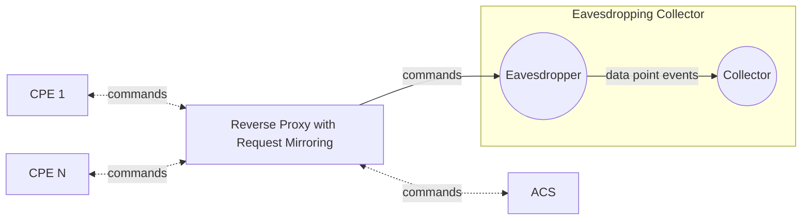

# CWMP interceptor

## Overview

This repository explores an approach to collecting telemetry from CPE devices. It contains anoter "frontend" for the CWMP and USP [Bulk Data Collector](https://github.com/zdrgeo/bulk-data-collector).
Instead of accepting bulk data reports in CSV or JSON format, this "frontend" intercepts the communication between the CPEs and the ACS. Eavesdrop the CWMP protocol Inform messages. Synthesize telemetry events from the collected device parameters and other device events and sends them to a dedicated analytics or telemetry platform using the available "backend" implementations from [Bulk Data Collector](https://github.com/zdrgeo/bulk-data-collector).

## Context

CWMP Intercepting Collector

CWMP Eavesdropping Collector

